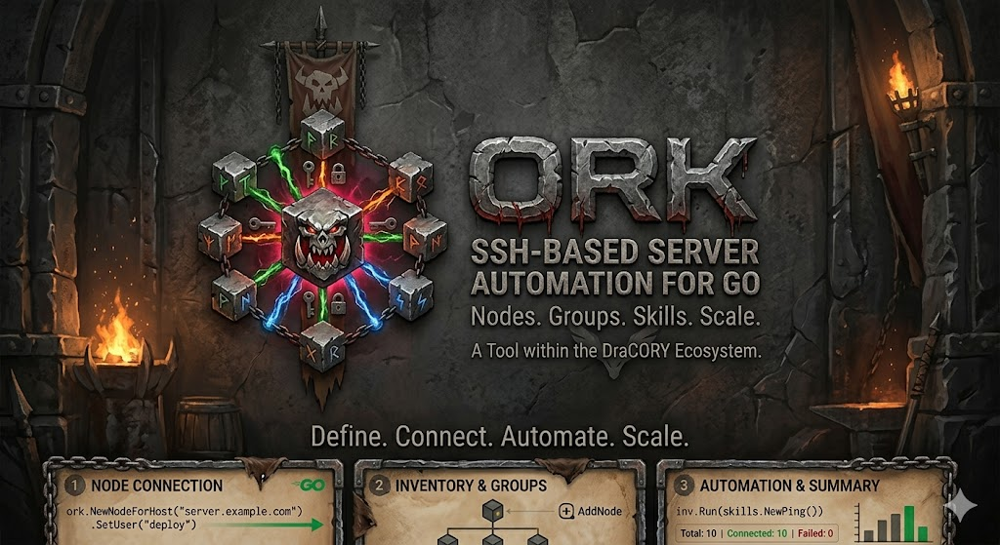

# Ork

<p align="center">
  
</p>

Ork is a Go package for SSH-based server automation. Think of it like Ansible, but in Go - you define **Nodes** (remote servers), organize them into **Groups**, and run commands, skills, or playbooks against them individually or at scale via **Inventory**.

## Installation

### Library

```bash
go get github.com/dracory/ork
```

### CLI Tool

```bash
go install github.com/dracory/ork/cmd/ork@latest
```

Or build from source:

```bash
git clone https://github.com/dracory/ork.git
cd ork
go build -o ork ./cmd/ork
```

## Documentation

Full documentation is available as a static HTML site in the [docs](docs/) directory. Start at [docs/index.html](docs/index.html) for a card-grid overview, or browse it online via [html-preview](https://html-preview.github.io/?url=https://github.com/dracory/ork/blob/main/docs/index.html).

### Getting Started

- [Overview](docs/overview.html) - High-level introduction to Ork and core concepts
- [Getting Started](docs/getting-started.html) - Step-by-step installation and first node guide
- [Quick Start](docs/quick-start.html) - Fastest path to running commands and skills

### Core Reference

- [Architecture](docs/architecture.html) - Layered architecture, design patterns, and concurrency model
- [API Reference](docs/api-reference.html) - Complete reference for all public interfaces and types
- [Configuration](docs/configuration.html) - NodeConfig structure, SSH settings, and dry-run mode
- [Commands](docs/commands.html) - Fluent API for one-off shell command execution
- [Skills](docs/skills.html) - Reusable, idempotent automation tasks and the full skill catalog
- [Playbooks](docs/playbooks.html) - Complex orchestration with full Go power

### Features

- [Idempotency](docs/idempotency.html) - Check-Run pattern for safe, repeatable operations
- [Dry-Run Mode](docs/dry-run.html) - Preview changes without execution
- [Privilege Escalation](docs/privilege-escalation.html) - Run commands as different users via sudo
- [Vault](docs/vault.html) - Secure secrets management (AES-256-GCM + Argon2id)
- [Advanced Usage](docs/advanced-usage.html) - Custom skills, internal packages, and advanced patterns

### Operations & Guides

- [Troubleshooting](docs/troubleshooting.html) - Common issues and solutions
- [Cheatsheet](docs/cheatsheet.html) - Quick reference for common operations
- [Conventions](docs/conventions.html) - Coding and documentation standards for contributors

### Reference

- [Comparison with Ansible](docs/comparison/ansible.md) - How Ork compares to Ansible

## License

This project is licensed under the GNU Affero General Public License v3.0 (AGPL-3.0). You can find a copy of the license at https://www.gnu.org/licenses/agpl-3.0.en.html

For commercial use, please use my contact page to obtain a commercial license.
