# Ork Architecture

This document describes the architecture of Ork, including design patterns, component relationships, and key architectural decisions.

## System Overview

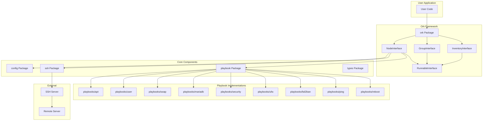

## Layered Architecture

Ork follows a layered architecture pattern:

### 1. API Layer (ork Package)

The public API that users interact with:

```go
// NodeInterface - Single server management
type NodeInterface interface {
    RunnableInterface
    GetHost() string
    SetPort(port string) NodeInterface
    Connect() error
    Close() error
    // ...
}

// GroupInterface - Server group management  
type GroupInterface interface {
    RunnableInterface
    GetName() string
    AddNode(node NodeInterface) GroupInterface
    // ...
}

// InventoryInterface - Multi-group management
type InventoryInterface interface {
    RunnableInterface
    AddGroup(group GroupInterface) InventoryInterface
    SetMaxConcurrency(max int) InventoryInterface
    // ...
}
```

### 2. Core Services Layer

#### SSH Package

Handles all SSH connectivity:

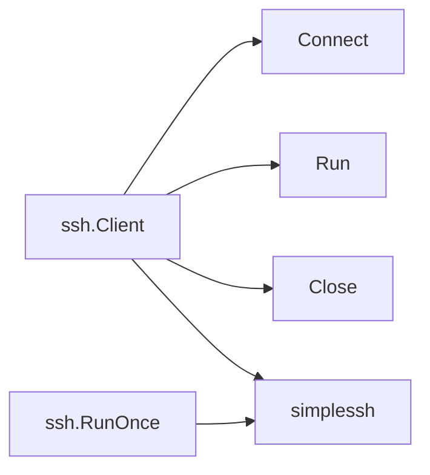

Key features:
- Connection pooling via persistent connections
- Dry-run mode support
- Key-based authentication

#### Config Package

Central configuration management:

```go
type NodeConfig struct {
    SSHHost      string
    SSHPort      string
    SSHLogin     string
    SSHKey       string
    RootUser     string
    NonRootUser  string
    DBPort       string
    DBRootPassword string
    Args         map[string]string
    Logger       *slog.Logger
    IsDryRunMode bool
}
```

### 3. Playbook System Layer

#### Playbook Interface

All automation tasks implement this interface:

```go
type PlaybookInterface interface {
    GetID() string
    GetDescription() string
    SetConfig(cfg config.NodeConfig) PlaybookInterface
    GetArg(key string) string
    SetArg(key, value string) PlaybookInterface
    Check() (bool, error)
    Run() Result
}
```

#### Base Playbook

Provides common functionality:

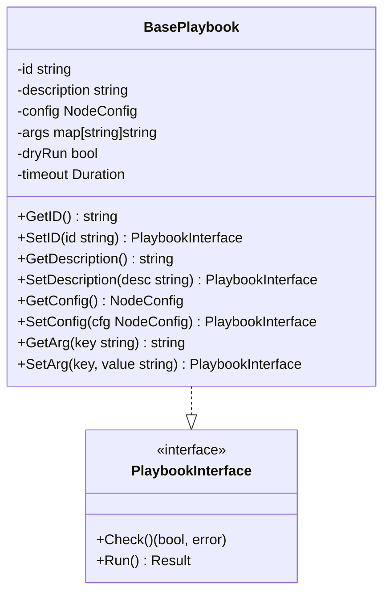

## Design Patterns

### 1. Fluent Interface (Method Chaining)

Configuration uses fluent API for readability:

```go
node := ork.NewNodeForHost("server.example.com").
    SetPort("2222").
    SetUser("deploy").
    SetKey("production.prv").
    SetArg("env", "production")
```

### 2. Repository Pattern (Registry)

Playbook registry for ID-based lookup:

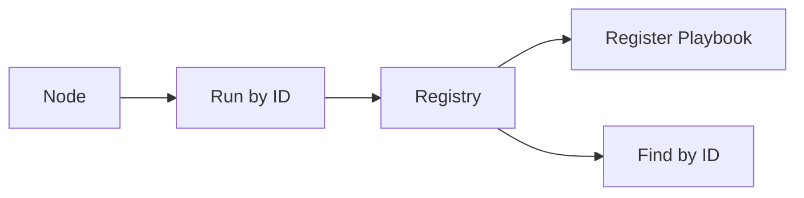

### 3. Strategy Pattern

Different playbooks implement the same interface:

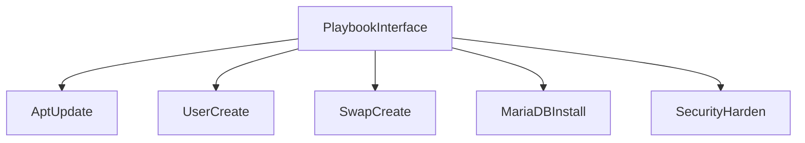

### 4. Composite Pattern

Inventory/Group/Node hierarchy:

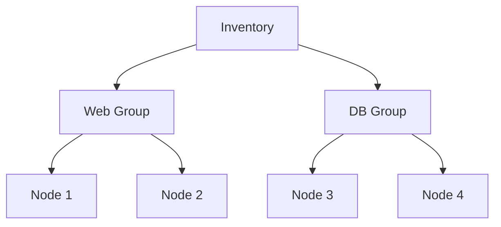

All implement `RunnableInterface` with unified execution.

### 5. Factory Pattern

Node creation methods:

```go
// Factory methods
func NewNodeForHost(host string) NodeInterface
func NewNode() NodeInterface
func NewNodeFromConfig(cfg config.NodeConfig) NodeInterface
func NewGroup(name string) GroupInterface
func NewInventory() InventoryInterface
```

## Concurrency Model

### Inventory-Level Concurrency

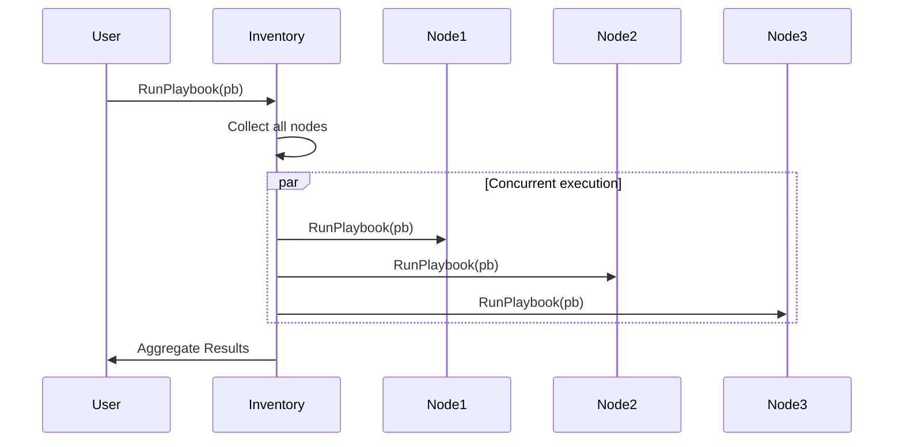

Configurable via `SetMaxConcurrency()`.

### Thread Safety

Key thread-safe mechanisms:

```go
// Group uses mutex for dry-run mode
type groupImplementation struct {
    // ...
    dryRunMode bool
    mu         sync.RWMutex
}

func (g *groupImplementation) SetDryRunMode(dryRun bool) RunnableInterface {
    g.mu.Lock()
    g.dryRunMode = dryRun
    g.mu.Unlock()
    // Propagate to nodes
    g.propagateDryRun()
    return g
}
```

## Data Flow

### Command Execution Flow

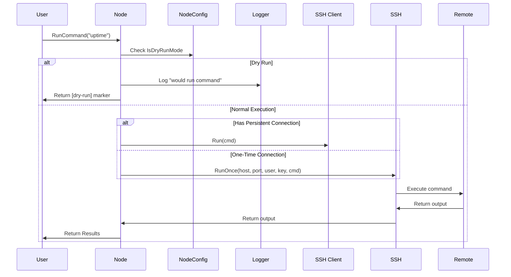

### Playbook Execution Flow

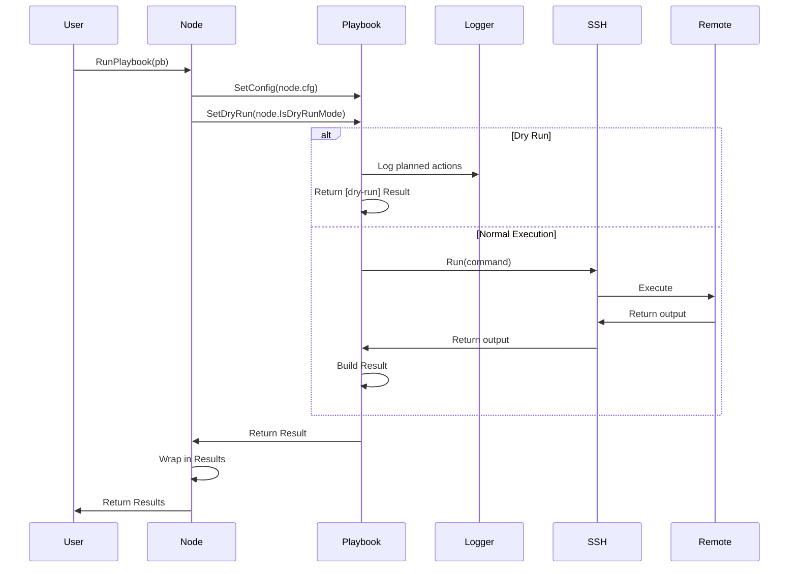

## Idempotency Design

All playbooks follow the Check-Run pattern:

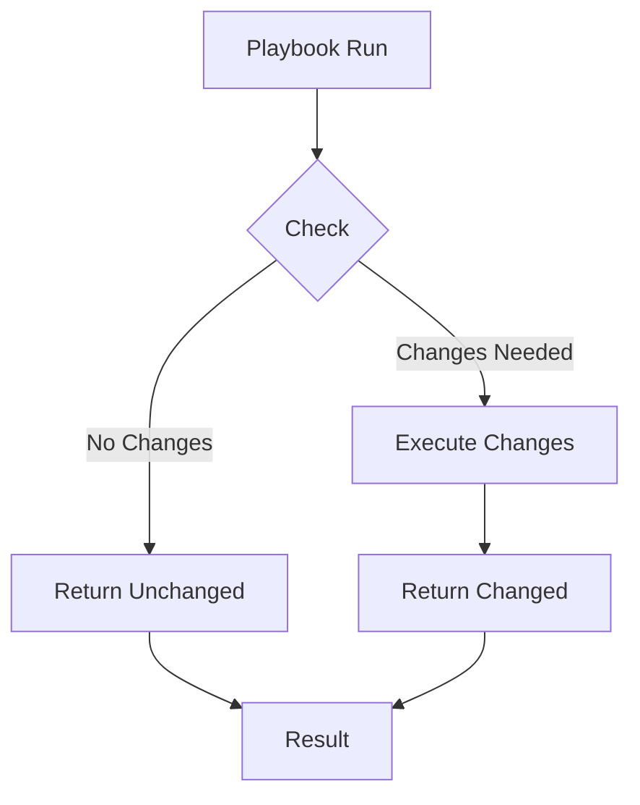

Example implementation:

```go
func (p *MyPlaybook) Check() (bool, error) {
    // Check current state
    output, _ := ssh.Run(cfg, "check command")
    return !isAlreadyConfigured(output), nil
}

func (p *MyPlaybook) Run() Result {
    needsChange, _ := p.Check()
    if !needsChange {
        return Result{Changed: false, Message: "Already configured"}
    }
    
    // Apply changes
    _, err := ssh.Run(cfg, "apply command")
    if err != nil {
        return Result{Changed: false, Error: err}
    }
    
    return Result{Changed: true, Message: "Changes applied"}
}
```

## Error Handling Strategy

### Result-Based Error Handling

```go
type Result struct {
    Changed bool
    Message string
    Details map[string]string
    Error   error  // Non-nil if execution failed
}
```

Errors bubble up with context:

```go
output, err := ssh.Run(cfg, cmd)
if err != nil {
    return playbook.Result{
        Changed: false,
        Message: "Operation failed",
        Error:   fmt.Errorf("failed to execute '%s': %w", cmd, err),
    }
}
```

## Security Architecture

### SSH Security

- Key-based authentication only
- Private keys stored in ~/.ssh/
- No password authentication in framework

### Dry-Run Safety

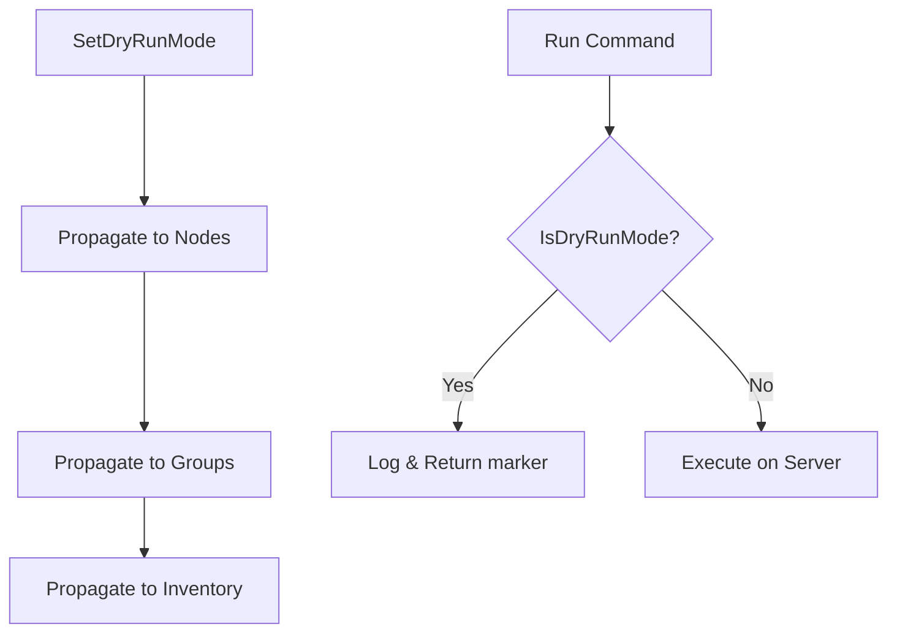

Safety enforced at execution layer - no way to bypass.

## Extension Points

### Custom Playbooks

```go
type MyPlaybook struct {
    *playbook.BasePlaybook
}

func (p *MyPlaybook) Check() (bool, error) { ... }
func (p *MyPlaybook) Run() playbook.Result { ... }

// Register globally
registry, err := ork.GetGlobalPlaybookRegistry()
if err != nil {
    log.Fatal(err)
}
registry.PlaybookRegister(myPlaybook)
```

### Custom SSH Logic

```go
// sshRunOnce is a variable that can be mocked
type sshRunOnce = func(host, port, user, key, cmd string) (string, error)
```

## See Also

- [Data Flow](data_flow.md) - Detailed data flow diagrams
- [Configuration](configuration.md) - Configuration options
- [API Reference](api_reference.md) - Complete API documentation
- [Modules](modules/ork.md) - Package-level documentation
