## Changelog
- **v2.1.0** (2026-07-31): Documented the skill-cloning concurrency model (ToMap/FromMap + cloneFromMap) and updated RunnableInterface, BaseSkill/BasePlaybook diagrams and Skill Execution Flow to reflect the cloning step
- **v2.0.0** (2026-04-15): Major terminology refactoring - playbooks renamed to skills, PlaybookInterface renamed to RunnableInterface, BasePlaybook moved to types package, NodeConfig moved to types package, config package removed, playbook package removed
- **v1.1.0** (2026-04-14): Updated architecture diagrams and package references
- **v1.0.0** (2025-04-14): Initial creation

# Ork Architecture

This document describes the architecture of Ork, including design patterns, component relationships, and key architectural decisions.

## System Overview

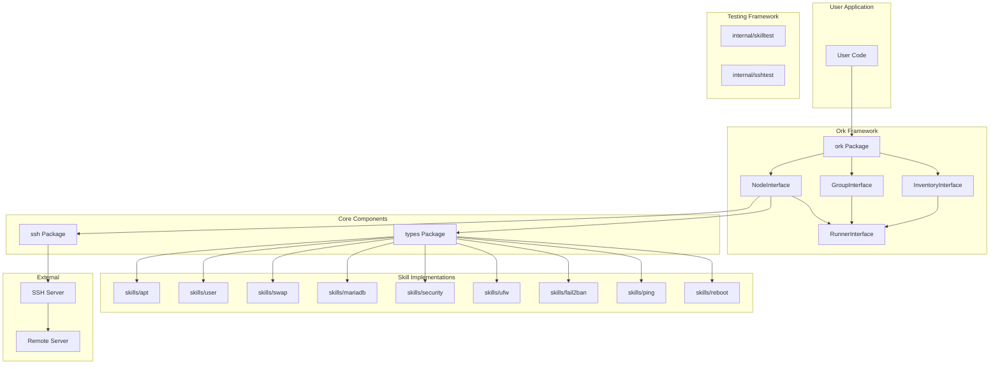
```mermaid
graph TB
    subgraph "User Application"
        A[User Code]
    end
    
    subgraph "Ork Framework"
        B[ork Package]
        C[NodeInterface]
        D[GroupInterface]
        E[InventoryInterface]
        F[RunnerInterface]
    end
    
    subgraph "Core Components"
        H[ssh Package]
        J[types Package]
    end
    
    subgraph "Testing Framework"
        TF1[internal/skilltest]
        TF2[internal/sshtest]
    end
    
    subgraph "Skill Implementations"
        K[skills/apt]
        L[skills/user]
        M[skills/swap]
        N[skills/mariadb]
        O[skills/security]
        P[skills/ufw]
        Q[skills/fail2ban]
        R[skills/ping]
        S[skills/reboot]
    end
    
    subgraph "External"
        T[SSH Server]
        U[Remote Server]
    end
    
    A --> B
    B --> C
    B --> D
    B --> E
    C --> F
    D --> F
    E --> F
    C --> H
    C --> J
    J --> K
    J --> L
    J --> M
    J --> N
    J --> O
    J --> P
    J --> Q
    J --> R
    J --> S
    H --> T
    T --> U
```

## Layered Architecture

Ork follows a layered architecture pattern:

### 1. API Layer (ork Package)

The public API that users interact with:

```go
// NodeInterface - Single server management
type NodeInterface interface {
    RunnerInterface
    GetHost() string
    SetPort(port string) NodeInterface
    Connect() error
    Close() error
    // ...
}

// GroupInterface - Server group management  
type GroupInterface interface {
    RunnerInterface
    GetName() string
    AddNode(node NodeInterface) GroupInterface
    // ...
}

// InventoryInterface - Multi-group management
type InventoryInterface interface {
    RunnerInterface
    AddGroup(group GroupInterface) InventoryInterface
    SetMaxConcurrency(max int) InventoryInterface
    // ...
}
```

### 2. Core Services Layer

#### SSH Package

Handles all SSH connectivity:

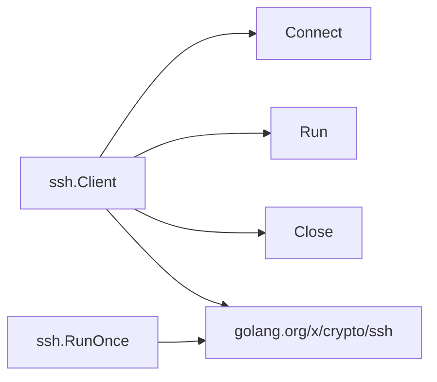
```mermaid
graph LR
    A[ssh.Client] --> B[Connect]
    A --> C[Run]
    A --> D[Close]
    E[ssh.RunOnce] --> F[golang.org/x/crypto/ssh]
    A --> F
```

Key features:
- Connection pooling via persistent connections
- Dry-run mode support
- Key-based authentication

#### Types Package

Central configuration and type definitions:

```go
type NodeConfig struct {
    SSHHost      string
    SSHPort      string
    SSHLogin     string
    SSHKey       string
    RootUser     string
    NonRootUser  string
    DBPort       string
    DBRootPassword string
    Args         map[string]string
    Logger       *slog.Logger
    IsDryRunMode bool
}
```

### 3. Skill System Layer

#### RunnableInterface (types package)

All automation tasks implement this interface (defined in types package):

```go
type RunnableInterface interface {
    GetID() string
    GetDescription() string
    SetNodeConfig(cfg NodeConfig) RunnableInterface
    GetArg(key string) string
    SetArg(key, value string) RunnableInterface
    Check() (bool, error)
    Run() Result
    ToMap() map[string]any   // serialize state for cloning
    FromMap(m map[string]any) // restore state from a clone
    BecomeInterface
}
```

The `ToMap()`/`FromMap()` pair is the contract the framework uses to clone a
runnable before mutating it during parallel execution (see
[Concurrency Model](#concurrency-model)).

#### BasePlaybook (types package)

Provides default implementation with fluent API. State is stored in an
`omni.AtomInterface` (thread-safe) plus a mutex-guarded `NodeConfig`:

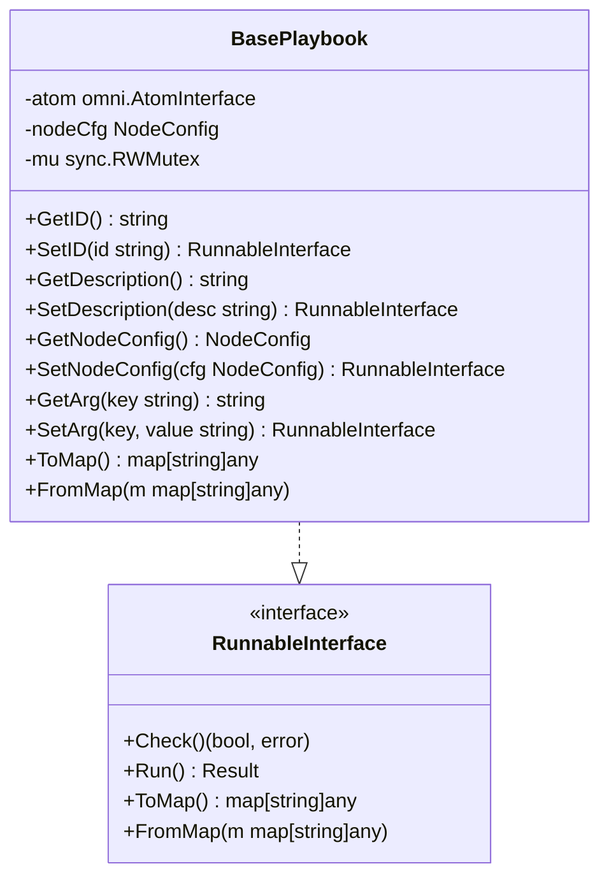
```mermaid
classDiagram
    class BasePlaybook {
        -atom omni.AtomInterface
        -nodeCfg NodeConfig
        -mu sync.RWMutex
        +GetID() string
        +SetID(id string) RunnableInterface
        +GetDescription() string
        +SetDescription(desc string) RunnableInterface
        +GetNodeConfig() NodeConfig
        +SetNodeConfig(cfg NodeConfig) RunnableInterface
        +GetArg(key string) string
        +SetArg(key, value string) RunnableInterface
        +ToMap() map[string]any
        +FromMap(m map[string]any)
    }

    class RunnableInterface {
        <<interface>>
        +Check() (bool, error)
        +Run() Result
        +ToMap() map[string]any
        +FromMap(m map[string]any)
    }

    BasePlaybook ..|> RunnableInterface
```

#### BaseSkill (types package)

Provides default implementation with `Check()` and `Run()` stubs. Uses the same
Atom-backed state storage and cloning contract as `BasePlaybook`:

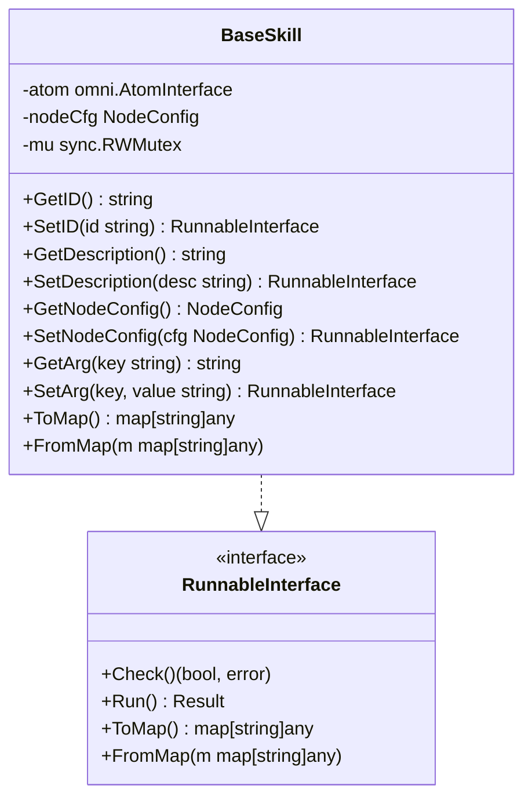
```mermaid
classDiagram
    class BaseSkill {
        -atom omni.AtomInterface
        -nodeCfg NodeConfig
        -mu sync.RWMutex
        +GetID() string
        +SetID(id string) RunnableInterface
        +GetDescription() string
        +SetDescription(desc string) RunnableInterface
        +GetNodeConfig() NodeConfig
        +SetNodeConfig(cfg NodeConfig) RunnableInterface
        +GetArg(key string) string
        +SetArg(key, value string) RunnableInterface
        +ToMap() map[string]any
        +FromMap(m map[string]any)
    }

    class RunnableInterface {
        <<interface>>
        +Check() (bool, error)
        +Run() Result
        +ToMap() map[string]any
        +FromMap(m map[string]any)
    }

    BaseSkill ..|> RunnableInterface
```

## Design Patterns

### 1. Fluent Interface (Method Chaining)

Configuration uses fluent API for readability:

```go
node := ork.NewNodeForHost("server.example.com").
    SetPort("2222").
    SetUser("deploy").
    SetKey("production.prv").
    SetArg("env", "production")
```

### 2. Repository Pattern (Registry)

Skill registry (types.Registry) for ID-based lookup:

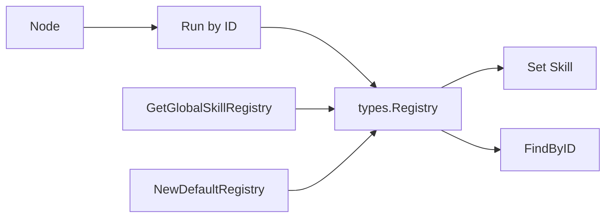
```mermaid
graph LR
    A[types.Registry] --> B[Set Skill]
    C[Node] --> D[Run by ID]
    D --> A
    A --> E[FindByID]
    F[GetGlobalSkillRegistry] --> A
    G[NewDefaultRegistry] --> A
```

### 3. Strategy Pattern

Different skills implement the same interface:

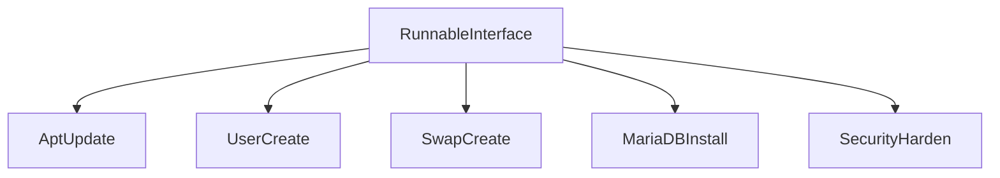
```mermaid
graph TB
    A[RunnableInterface] --> B[AptUpdate]
    A --> C[UserCreate]
    A --> D[SwapCreate]
    A --> E[MariaDBInstall]
    A --> F[SecurityHarden]
```

### 4. Composite Pattern

Inventory/Group/Node hierarchy:

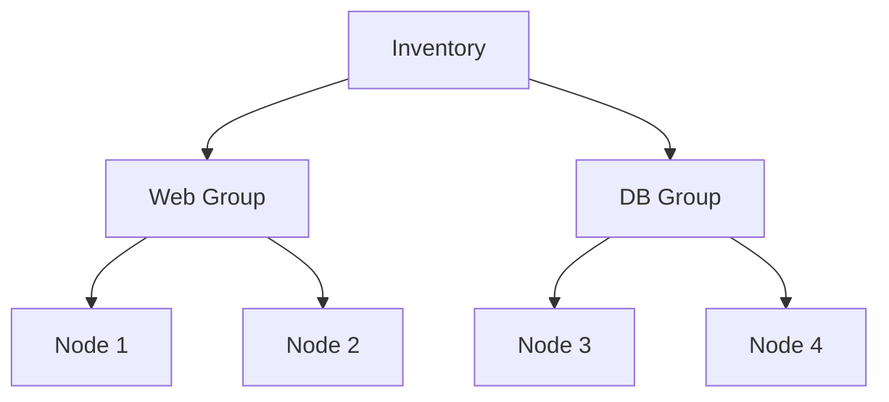
```mermaid
graph TD
    A[Inventory] --> B[Web Group]
    A --> C[DB Group]
    B --> D[Node 1]
    B --> E[Node 2]
    C --> F[Node 3]
    C --> G[Node 4]
```

All implement `RunnerInterface` with unified execution.

### 5. Factory Pattern

Node creation methods:

```go
// Factory methods
func NewNodeForHost(host string) NodeInterface
func NewNode() NodeInterface
func NewNodeFromConfig(cfg types.NodeConfig) NodeInterface
func NewGroup(name string) GroupInterface
func NewInventory() InventoryInterface
```

## Concurrency Model

### Inventory-Level Concurrency

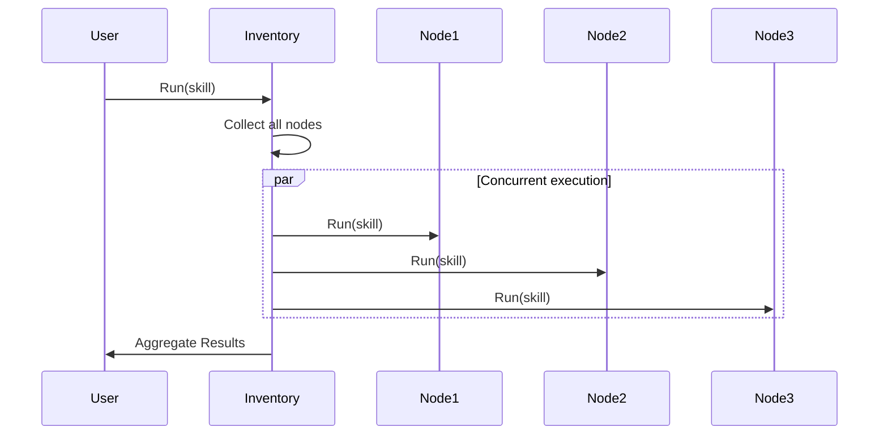
```mermaid
sequenceDiagram
    User->>Inventory: Run(skill)
    Inventory->>Inventory: Collect all nodes
    par Concurrent execution
        Inventory->>Node1: Run(skill)
        Inventory->>Node2: Run(skill)
        Inventory->>Node3: Run(skill)
    end
    Inventory->>User: Aggregate Results
```

Configurable via `SetMaxConcurrency()`.

### Skill Cloning (per-goroutine isolation)

When `Inventory` (or `Group`) runs a single shared skill instance across many
nodes concurrently, the framework must not let goroutines mutate the same skill
fields. To guarantee this, `nodeImplementation` clones the skill **before**
setting any per-execution state on it:

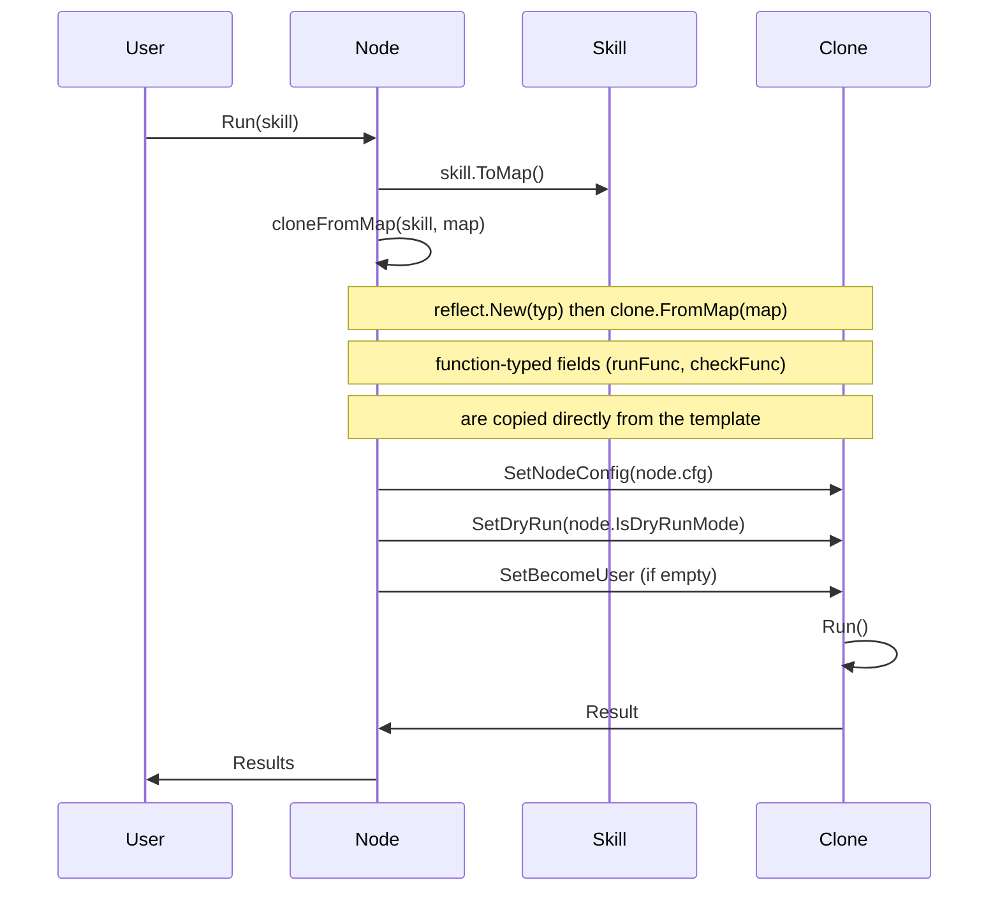
```mermaid
sequenceDiagram
    User->>Node: Run(skill)
    Node->>Skill: skill.ToMap()
    Node->>Node: cloneFromMap(skill, map)
    Note over Node,Clone: reflect.New(typ) then clone.FromMap(map)
    Note over Node,Clone: function-typed fields (runFunc, checkFunc)
    Note over Node,Clone: are copied directly from the template
    Node->>Clone: SetNodeConfig(node.cfg)
    Node->>Clone: SetDryRun(node.IsDryRunMode)
    Node->>Clone: SetBecomeUser (if empty)
    Clone->>Clone: Run()
    Clone->>Node: Result
    Node->>User: Results
```

The clone is created via `cloneFromMap(template, m)` in `node_implementation.go`,
which uses `reflect.New` to allocate a fresh value of the same concrete type as
the template, calls `FromMap(m)` to restore serializable state, and then copies
function-typed fields (`runFunc`, `checkFunc`, ...) directly from the template
because they cannot survive a `ToMap`/`FromMap` round-trip.

**Requirements for custom skill types:**

- Implement `ToMap()`/`FromMap()` to serialize any custom non-function fields.
  Fields that are neither serialized via `ToMap`/`FromMap` nor function-typed
  will be lost on clone. For example, `commandImplementation` overrides
  `ToMap`/`FromMap` to preserve `command`/`required`/`chdir`.
- The embedded `*BaseSkill` / `*BasePlaybook` already implements
  `ToMap()`/`FromMap()` for the standard properties (`id`, `description`,
  `args`, `dryRun`, `timeout`, `becomeUser`, `nodeConfig`).

A race-detector test (`race_detector_test.go`) verifies that concurrent
`node.Run()` calls sharing a single skill instance do not race.

### Thread Safety

Key thread-safe mechanisms:

```go
// Group uses mutex for dry-run mode
type groupImplementation struct {
    // ...
    dryRunMode bool
    mu         sync.RWMutex
}

func (g *groupImplementation) SetDryRunMode(dryRun bool) RunnerInterface {
    g.mu.Lock()
    g.dryRunMode = dryRun
    g.mu.Unlock()
    // Propagate to nodes
    g.propagateDryRun()
    return g
}
```

`BaseSkill` and `BasePlaybook` store simple properties in an `omni.AtomInterface`
(thread-safe via its own `sync.RWMutex`) and guard `NodeConfig` with a per-struct
`sync.RWMutex`. Combined with the per-call cloning above, this means the original
shared skill instance is never mutated during parallel execution.

## Data Flow

### Command Execution Flow

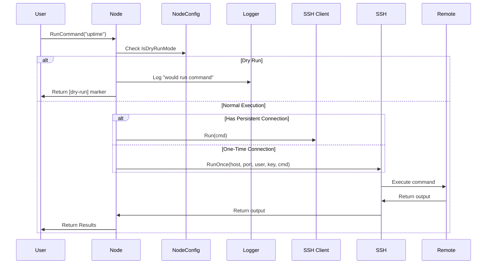
```mermaid
sequenceDiagram
    User->>Node: RunCommand("uptime")
    Node->>NodeConfig: Check IsDryRunMode
    alt Dry Run
        Node->>Logger: Log "would run command"
        Node->>User: Return [dry-run] marker
    else Normal Execution
        alt Has Persistent Connection
            Node->>SSH Client: Run(cmd)
        else One-Time Connection
            Node->>SSH: RunOnce(host, port, user, key, cmd)
        end
        SSH->>Remote: Execute command
        Remote->>SSH: Return output
        SSH->>Node: Return output
        Node->>User: Return Results
    end
```

### Skill Execution Flow

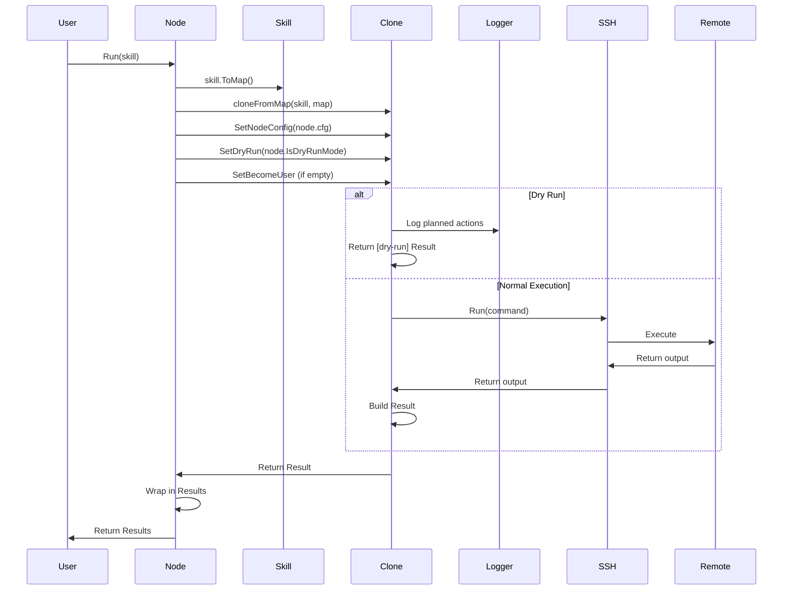
```mermaid
sequenceDiagram
    User->>Node: Run(skill)
    Node->>Skill: skill.ToMap()
    Node->>Clone: cloneFromMap(skill, map)
    Node->>Clone: SetNodeConfig(node.cfg)
    Node->>Clone: SetDryRun(node.IsDryRunMode)
    Node->>Clone: SetBecomeUser (if empty)

    alt Dry Run
        Clone->>Logger: Log planned actions
        Clone->>Clone: Return [dry-run] Result
    else Normal Execution
        Clone->>SSH: Run(command)
        SSH->>Remote: Execute
        Remote->>SSH: Return output
        SSH->>Clone: Return output
        Clone->>Clone: Build Result
    end

    Clone->>Node: Return Result
    Node->>Node: Wrap in Results
    Node->>User: Return Results
```

## Idempotency Design

All skills follow the Check-Run pattern:

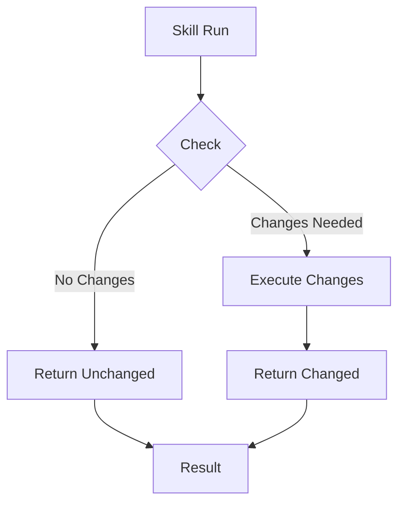
```mermaid
graph TD
    A[Skill Run] --> B{Check}
    B -->|Changes Needed| C[Execute Changes]
    B -->|No Changes| D[Return Unchanged]
    C --> E[Return Changed]
    D --> F[Result]
    E --> F
```

Example implementation:

```go
func (p *MySkill) Check() (bool, error) {
    // Check current state
    output, _ := ssh.Run(cfg, "check command")
    return !isAlreadyConfigured(output), nil
}

func (p *MySkill) Run() Result {
    needsChange, _ := p.Check()
    if !needsChange {
        return Result{Changed: false, Message: "Already configured"}
    }
    
    // Apply changes
    _, err := ssh.Run(cfg, "apply command")
    if err != nil {
        return Result{Changed: false, Error: err}
    }
    
    return Result{Changed: true, Message: "Changes applied"}
}
```

## Error Handling Strategy

### Result-Based Error Handling

```go
type Result struct {
    Changed bool
    Message string
    Details map[string]string
    Error   error  // Non-nil if execution failed
}
```

Errors bubble up with context:

```go
output, err := ssh.Run(cfg, cmd)
if err != nil {
    return types.Result{
        Changed: false,
        Message: "Operation failed",
        Error:   fmt.Errorf("failed to execute '%s': %w", cmd, err),
    }
}
```

## Security Architecture

### SSH Security

- Key-based authentication only
- Private keys stored in ~/.ssh/
- No password authentication in framework

### Dry-Run Safety

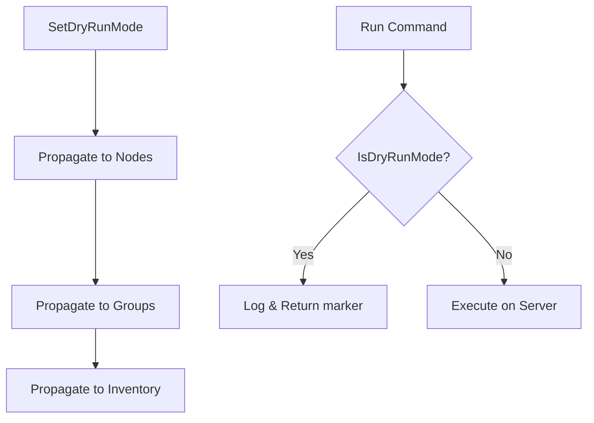
```mermaid
graph TD
    A[SetDryRunMode] --> B[Propagate to Nodes]
    B --> C[Propagate to Groups]
    C --> D[Propagate to Inventory]
    E[Run Command] --> F{IsDryRunMode?}
    F -->|Yes| G[Log & Return marker]
    F -->|No| H[Execute on Server]
```

Safety enforced at execution layer - no way to bypass.

## Extension Points

### Custom Skills

```go
type MySkill struct {
    *types.BaseSkill
}

func (p *MySkill) Check() (bool, error) { ... }
func (p *MySkill) Run() types.Result { ... }

// Register globally
registry, err := ork.GetGlobalSkillRegistry()
if err != nil {
    log.Fatal(err)
}
registry.Set(mySkill)
```

## See Also

- [Data Flow](data_flow.md) - Detailed data flow diagrams
- [Configuration](configuration.md) - Configuration options
- [API Reference](api_reference.md) - Complete API documentation
- [Modules](modules/ork.md) - Package-level documentation
