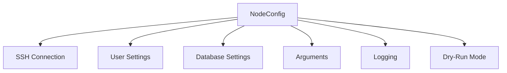

# Configuration

This document describes all configuration options available in Ork.

## Configuration Hierarchy

Configuration can be set at multiple levels, with more specific levels overriding broader ones:



## NodeConfig Structure

```go
type NodeConfig struct {
    // SSH connection settings
    SSHHost  string  // Hostname or IP address
    SSHPort  string  // SSH port (default: "22")
    SSHLogin string  // SSH login user
    SSHKey   string  // Private key filename
    
    // User settings
    RootUser    string  // Root/admin user for privileged operations
    NonRootUser string  // Non-root user for non-privileged operations
    
    // Database settings
    DBPort         string  // Database port (e.g., "3306")
    DBRootPassword string  // Database root password
    
    // Arguments for playbooks
    Args map[string]string
    
    // Logger for structured logging
    Logger *slog.Logger
    
    // Dry-run mode flag
    IsDryRunMode bool
}
```

## SSH Connection Settings

### SSHHost

The hostname or IP address of the remote server.

```go
// Via constructor
node := ork.NewNodeForHost("server.example.com")

// Via config
node := ork.NewNodeFromConfig(config.NodeConfig{
    SSHHost: "192.168.1.100",
})
```

### SSHPort

The SSH port for the connection.

```go
// Default is "22"
node := ork.NewNodeForHost("server.example.com")

// Custom port
node.SetPort("2222")

// Via config
cfg := config.NodeConfig{
    SSHHost: "server.example.com",
    SSHPort: "40022",
}
```

### SSHLogin

The SSH login user. Usually set from RootUser or NonRootUser.

### SSHKey

The SSH private key filename (not full path). Keys are resolved to `~/.ssh/<key>`.

```go
// Default is "id_rsa"
node := ork.NewNodeForHost("server.example.com")

// Custom key
node.SetKey("production.prv")

// Via config
cfg := config.NodeConfig{
    SSHKey: "deploy_key",
}
```

## User Settings

### RootUser

The root/admin user for privileged operations.

```go
// Default is "root"
node := ork.NewNodeForHost("server.example.com")

// Custom root user
node.SetUser("admin")
```

### NonRootUser

A non-root user for operations that don't require root access.

## Database Settings

### DBPort

The database server port.

```go
node.SetArg("db-port", "3307")  // Non-standard MariaDB port
```

### DBRootPassword

The database root password.

```go
node.SetArg("root-password", "secure-password")
results := node.RunPlaybook(playbooks.NewSecure())
```

## Arguments

Arguments are key-value pairs passed to playbooks for configuration.

### Setting Arguments

```go
// Single argument
node.SetArg("username", "alice")

// Multiple arguments
node.SetArg("username", "alice").
    SetArg("shell", "/bin/bash").
    SetArg("password", "secret123")

// Replace all arguments
node.SetArgs(map[string]string{
    "username": "alice",
    "shell":    "/bin/bash",
})
```

### Common Arguments by Playbook

#### User Management

| Argument | Description | Required |
|----------|-------------|----------|
| `username` | Username to create/delete | Yes |
| `shell` | Login shell (default: /bin/bash) | No |
| `password` | Initial password | No |
| `ssh-key` | SSH public key | No |

#### Swap Management

| Argument | Description | Default |
|----------|-------------|---------|
| `size` | Swap file size in GB | "1" |
| `unit` | Size unit (gb or mb) | "gb" |
| `swappiness` | Kernel swappiness (0-100) | "10" |

#### MariaDB

| Argument | Description | Required |
|----------|-------------|----------|
| `database` | Database name | Varies |
| `username` | Database username | Varies |
| `password` | Database password | Varies |
| `port` | MariaDB port | No |
| `root-password` | Root password | Varies |

#### Security

| Argument | Description | Default |
|----------|-------------|---------|
| `non-root-user` | User to verify before hardening | "deploy" |
| `ssh-config-path` | SSH config file path | "/etc/ssh/sshd_config" |
| `max-auth-tries` | Max auth attempts | "3" |

### Retrieving Arguments

```go
// Single argument
username := node.GetArg("username")

// All arguments
args := node.GetArgs()
for key, value := range args {
    log.Printf("%s: %s", key, value)
}
```

## Logging

### Setting a Custom Logger

```go
import "log/slog"

// Create custom logger
logger := slog.New(slog.NewJSONHandler(os.Stdout, nil))

// Set on node
node.SetLogger(logger)

// Set on group
group.SetLogger(logger)

// Set on inventory
inv.SetLogger(logger)
```

### Logger in Config

```go
cfg := config.NodeConfig{
    Logger: slog.Default(),
}

// Or use default
logger := cfg.GetLoggerOrDefault()
```

## Dry-Run Mode

Dry-run mode allows you to preview changes without executing commands on the server.

### Enabling Dry-Run

```go
// At node level
node := ork.NewNodeForHost("server.example.com").
    SetDryRunMode(true)

// At group level
group := ork.NewGroup("webservers")
group.SetDryRunMode(true)

// At inventory level
inv := ork.NewInventory()
inv.SetDryRunMode(true)
```

### Propagation

Dry-run mode propagates from parent to child:

```
Inventory (SetDryRunMode)
  ↓
Group (inherits)
  ↓
Node (inherits)
  ↓
Playbook (inherits)
```

```go
// Set on inventory, affects all
inv.SetDryRunMode(true)
results := inv.RunPlaybook(playbooks.NewAptUpgrade())
// All nodes in all groups will be in dry-run mode
```

### Detecting Dry-Run in Playbooks

```go
func (p *MyPlaybook) Run() playbook.Result {
    cfg := p.GetConfig()
    
    if cfg.IsDryRunMode {
        return playbook.Result{
            Changed: true,
            Message: "Would execute: some-command",
        }
    }
    
    // Normal execution
    output, err := ssh.Run(cfg, "some-command")
    // ...
}
```

## SSH Configuration Methods

### Method 1: Fluent API

```go
node := ork.NewNodeForHost("server.example.com").
    SetPort("2222").
    SetUser("deploy").
    SetKey("production.prv")
```

### Method 2: From Config

```go
cfg := config.NodeConfig{
    SSHHost:  "server.example.com",
    SSHPort:  "2222",
    RootUser: "deploy",
    SSHKey:   "production.prv",
    Args: map[string]string{
        "username": "alice",
    },
}

node := ork.NewNodeFromConfig(cfg)
```

### Method 3: Build Node, Then Configure

```go
node := ork.NewNode()  // Empty node
node.SetArg("host", "server.example.com")  // Note: this goes to Args, not SSHHost!
// This won't work for SSH connection!
```

**Note**: Use `NewNodeForHost()` for SSH connections, not `NewNode()`.

## Inspecting Configuration

```go
node := ork.NewNodeForHost("server.example.com").
    SetPort("2222").
    SetUser("deploy")

// Get individual values
host := node.GetHost()    // "server.example.com"
port := node.GetPort()    // "2222"
user := node.GetUser()    // "deploy"
key := node.GetKey()      // "id_rsa" (default)

// Get full config
cfg := node.GetNodeConfig()
addr := cfg.SSHAddr()     // "server.example.com:2222"
```

## SSHAddr Helper

```go
cfg := config.NodeConfig{
    SSHHost: "server.example.com",
    SSHPort: "2222",
}

addr := cfg.SSHAddr()  // "server.example.com:2222"

// Empty port defaults to "22"
cfg2 := config.NodeConfig{
    SSHHost: "server.example.com",
}
addr2 := cfg2.SSHAddr()  // "server.example.com:22"
```

## Complete Configuration Example

```go
package main

import (
    "log/slog"
    "os"
    "github.com/dracory/ork"
    "github.com/dracory/ork/config"
    "github.com/dracory/ork/playbooks"
)

func main() {
    // Create structured logger
    logger := slog.New(slog.NewJSONHandler(os.Stdout, nil))
    
    // Create node with full configuration
    node := ork.NewNodeForHost("db.production.example.com").
        SetPort("40022").
        SetUser("admin").
        SetKey("production_deploy.prv").
        SetLogger(logger)
    
    // Set playbook-specific arguments
    node.SetArg("username", "appuser").
        SetArg("shell", "/bin/bash").
        SetArg("ssh-key", "ssh-rsa AAAAB3...")
    
    // Get the config for inspection
    cfg := node.GetNodeConfig()
    logger.Info("configuration", 
        "host", cfg.SSHHost,
        "port", cfg.SSHPort,
        "addr", cfg.SSHAddr(),
    )
    
    // Run playbooks
    results := node.RunPlaybook(playbooks.NewPing())
    if results.Results["db.production.example.com"].Error != nil {
        logger.Error("connection failed")
        return
    }
    
    // Enable dry-run for testing
    node.SetDryRunMode(true)
    results = node.RunPlaybook(playbooks.NewUserCreate())
    logger.Info("dry-run result", 
        "changed", results.Results["db.production.example.com"].Changed,
        "message", results.Results["db.production.example.com"].Message,
    )
}
```

## See Also

- [Getting Started](getting_started.md) - Basic usage
- [API Reference](api_reference.md) - Complete API documentation
- [Architecture](architecture.md) - System architecture
