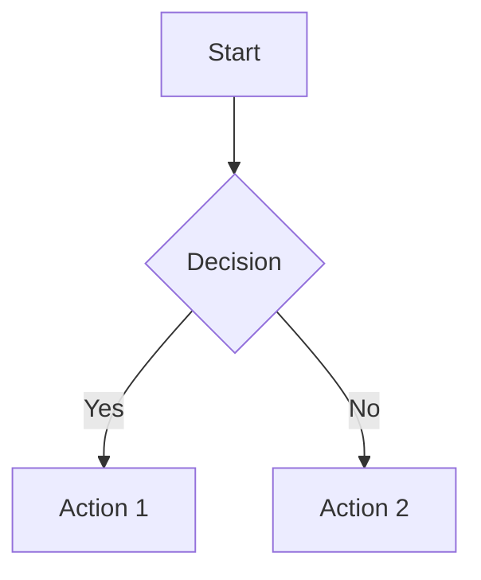

# Ork Conventions

Coding and documentation standards for Ork.

## Naming Conventions

### Interfaces

- Suffix with `Interface`
- PascalCase

```go
type NodeInterface interface { }
type PlaybookInterface interface { }
type RunnerInterface interface { }
```

### Implementations

- Suffix with `Implementation`
- camelCase (unexported)

```go
type nodeImplementation struct { }
type groupImplementation struct { }
```

### Constructor Functions

- Prefix with `New`
- Describe what is being created
- Use `For` prefix when parameter is the main identifier

```go
func NewNodeForHost(host string) NodeInterface
func NewGroup(name string) GroupInterface
func NewInventory() InventoryInterface
func NewPing() types.PlaybookInterface
func NewAptUpdate() types.PlaybookInterface
```

### Constants

- **Playbook IDs**: `ID` prefix, PascalCase
  ```go
  const IDAptUpdate = "apt-update"
  const IDUserCreate = "user-create"
  ```

- **Argument keys**: `Arg` prefix, PascalCase
  ```go
  const ArgUsername = "username"
  const ArgSize = "size"
  ```

- **Default values**: `Default` prefix, PascalCase
  ```go
  const DefaultShell = "/bin/bash"
  const DefaultSize = "1"
  ```

- **Ork package aliases**: `Playbook` prefix
  ```go
  const PlaybookAptUpdate = playbooks.IDAptUpdate
  ```

## File Organization

### Package Layout

```
package/
├── doc.go           # Package documentation
├── interface.go     # Interface definitions
├── implementation.go # Implementation
├── constants.go     # Constants
├── functions.go     # Utility functions
└── *_test.go        # Tests
```

### Example: Playbook Package

```
playbooks/mypackage/
├── constants.go     # Arg constants, defaults
├── myplaybook.go    # Playbook implementation
└── myplaybook_test.go
```

## Code Style

### Imports

Group imports: standard library, third-party, internal

```go
import (
    "fmt"
    "log/slog"
    
    "github.com/dracory/ork/playbook"
    "github.com/dracory/ork/ssh"
)
```

### Documentation Comments

All public items must have documentation:

```go
// MyPlaybook does something useful.
// It provides functionality for X and Y.
type MyPlaybook struct {
    *playbook.BasePlaybook
}

// Check determines if changes are needed.
// Returns true if the system is not in the desired state.
func (m *MyPlaybook) Check() (bool, error) {
    // ...
}

// Run executes the playbook and returns the result.
// Changed will be true if modifications were made.
func (m *MyPlaybook) Run() playbook.Result {
    // ...
}
```

### Error Handling

Always wrap errors with context:

```go
output, err := ssh.Run(cfg, cmd)
if err != nil {
    return playbook.Result{
        Changed: false,
        Error:   fmt.Errorf("failed to execute '%s': %w", cmd, err),
    }
}
```

### Fluent Interface

Return interface type for chaining:

```go
func (n *nodeImplementation) SetPort(port string) NodeInterface {
    n.cfg.SSHPort = port
    return n
}
```

## Playbook Structure

### Standard Playbook Template

```go
// Package mypackage provides playbooks for X.
package mypackage

import (
    "fmt"
    "github.com/dracory/ork/playbook"
    "github.com/dracory/ork/ssh"
)

// Arg constants
const (
    ArgParameter = "parameter"
    DefaultValue = "default"
)

// MyPlaybook does something.
type MyPlaybook struct {
    *playbook.BasePlaybook
}

// Check determines if changes are needed.
func (m *MyPlaybook) Check() (bool, error) {
    cfg := m.GetConfig()
    parameter := m.GetArg(ArgParameter)
    
    // Check current state
    output, _ := ssh.Run(cfg, fmt.Sprintf("check %s", parameter))
    return output == "", nil
}

// Run executes the playbook.
func (m *MyPlaybook) Run() playbook.Result {
    cfg := m.GetConfig()
    parameter := m.GetArg(ArgParameter)
    
    if parameter == "" {
        parameter = DefaultValue
    }
    
    // Handle dry-run
    if cfg.IsDryRunMode {
        return playbook.Result{
            Changed: true,
            Message: fmt.Sprintf("Would run with %s", parameter),
        }
    }
    
    // Check if needed
    needsChange, _ := m.Check()
    if !needsChange {
        return playbook.Result{
            Changed: false,
            Message: "Already configured",
        }
    }
    
    // Apply changes
    _, err := ssh.Run(cfg, fmt.Sprintf("apply %s", parameter))
    if err != nil {
        return playbook.Result{
            Changed: false,
            Error:   err,
        }
    }
    
    return playbook.Result{
        Changed: true,
        Message: fmt.Sprintf("Applied %s", parameter),
        Details: map[string]string{
            "parameter": parameter,
        },
    }
}

// NewMyPlaybook creates a new instance.
func NewMyPlaybook() types.PlaybookInterface {
    pb := playbook.NewBasePlaybook()
    pb.SetID(playbooks.IDMyPlaybook)
    pb.SetDescription("Does something useful")
    return &MyPlaybook{BasePlaybook: pb}
}
```

## Documentation Standards

### LiveWiki Frontmatter

Every documentation file must include:

```markdown
---
path: filename.md
page-type: overview | reference | tutorial | module | changelog
summary: One-line description of this page's content.
tags: [tag1, tag2, tag3]
created: YYYY-MM-DD
updated: YYYY-MM-DD
version: X.Y.Z
---
```

### Page Types

| Type | Use For |
|------|---------|
| `overview` | High-level introductions |
| `reference` | API docs, technical specs |
| `tutorial` | Step-by-step guides |
| `module` | Package documentation |
| `changelog` | Version history |

### Mermaid Diagrams

Use for architecture and data flow:

```markdown

```

## Testing Conventions

### Test File Names

```
node_implementation.go → node_implementation_test.go
```

### Test Function Names

```go
func TestNode_NewNodeForHost(t *testing.T)
func TestNode_RunCommand(t *testing.T)
func TestAptUpdate_Check(t *testing.T)
```

### Mock Pattern

```go
func TestSomething(t *testing.T) {
    // Mock SSH via SetRunFunc
    ssh.SetRunFunc(func(cfg config.NodeConfig, cmd types.Command) (string, error) {
        return "mocked", nil
    })
    defer ssh.SetRunFunc(nil)

    // Test
    // ...
}
```

## Commit Message Format

```
<type>: <short summary>

<body>

<footer>
```

Types:
- `feat`: New feature
- `fix`: Bug fix
- `docs`: Documentation
- `test`: Tests
- `refactor`: Code refactoring
- `chore`: Maintenance

Example:
```
feat: add mysql backup playbook

- Implements mysqldump-based backup
- Supports compression and encryption
- Includes comprehensive tests
```

## See Also

- [Development Guide](development.md) - Development workflow
- [Troubleshooting](troubleshooting.md) - Common issues
