# Data Flow

This document describes how data flows through the Ork system during various operations.

## Node Creation Flow

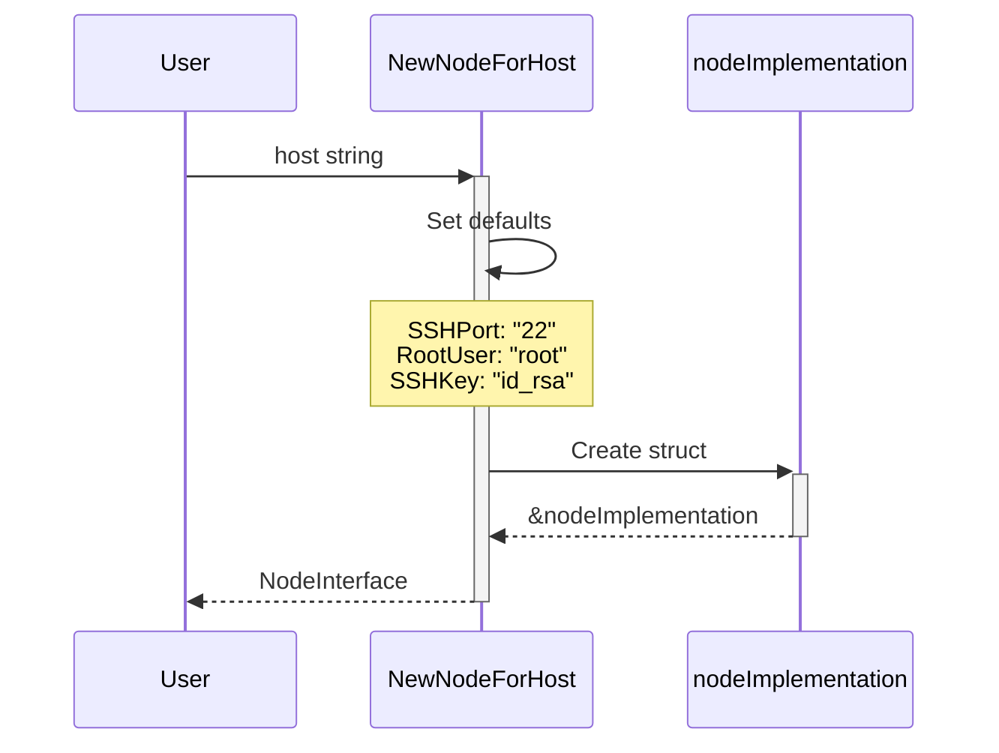

### Configuration Flow

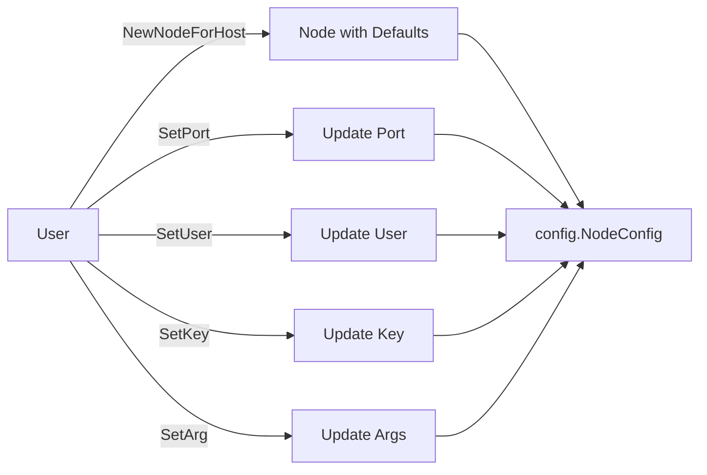

## Command Execution Flow

### RunCommand (One-Time Connection)

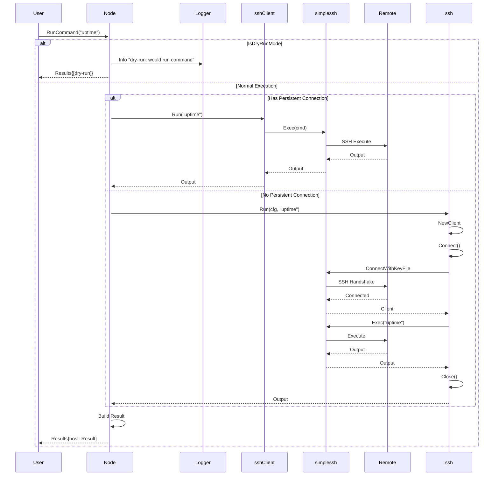

### Persistent Connection Flow

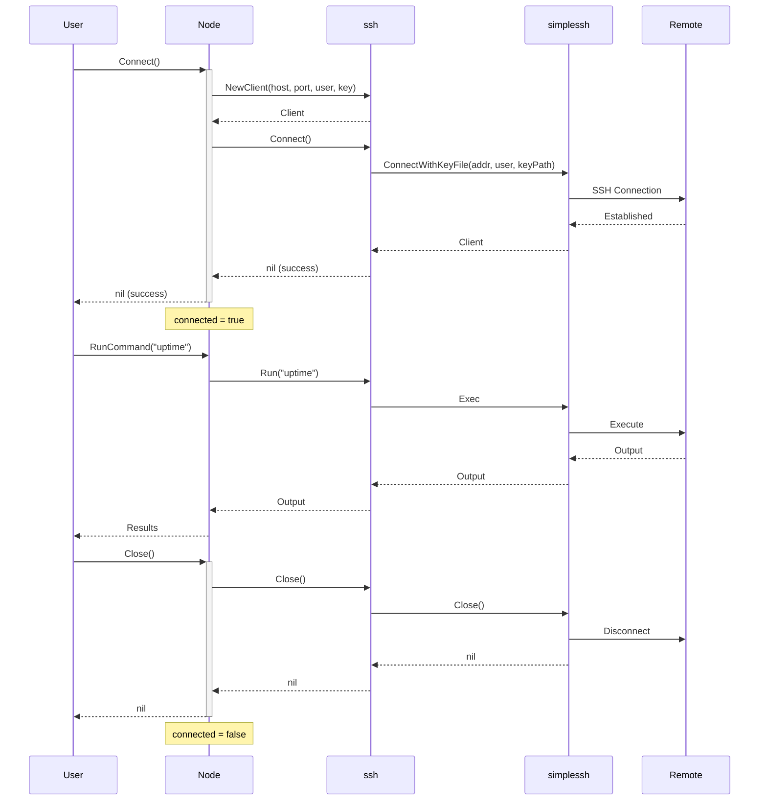

## Playbook Execution Flow

### Direct Playbook Execution

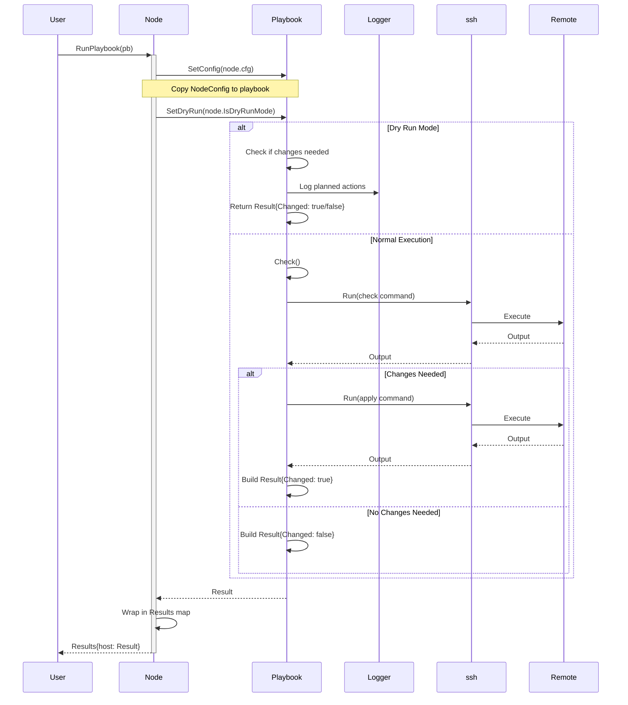

### Registry-Based Playbook Execution

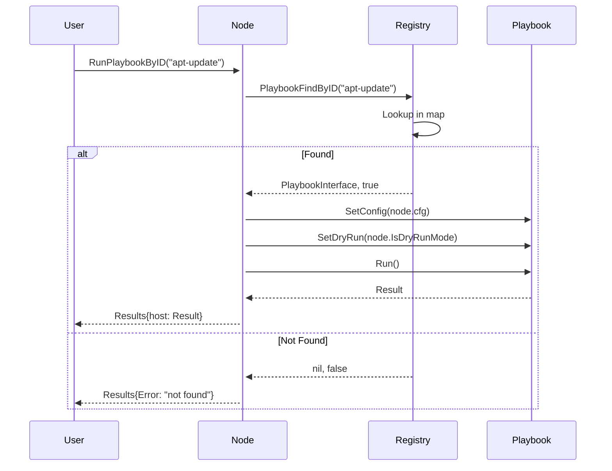

## Group Execution Flow

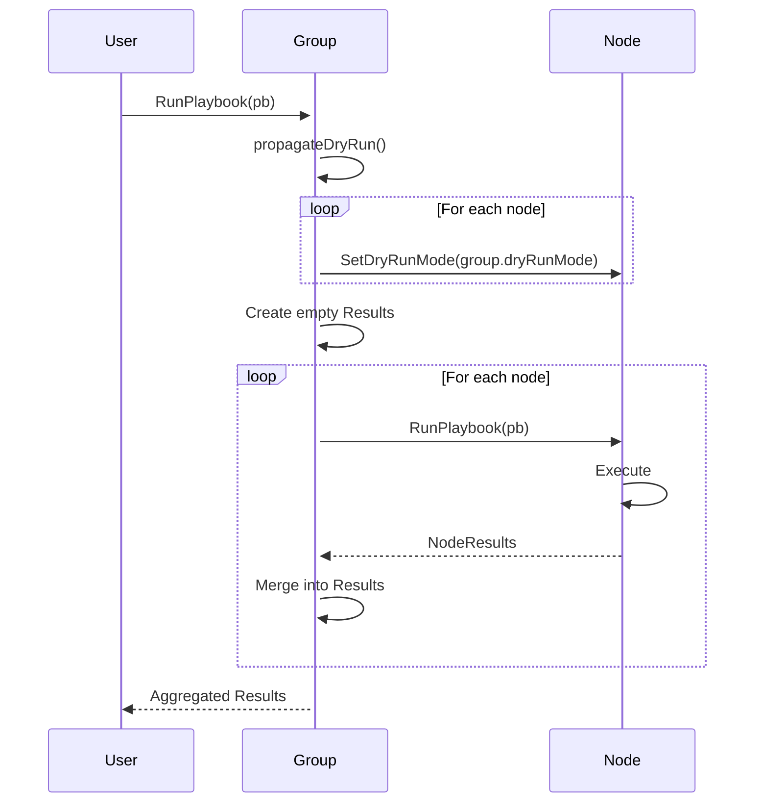

## Inventory Execution Flow

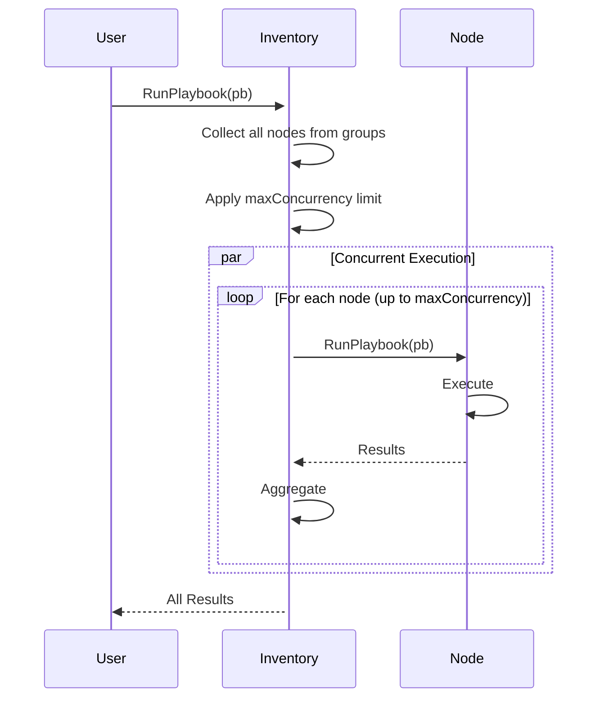

## Dry-Run Mode Propagation

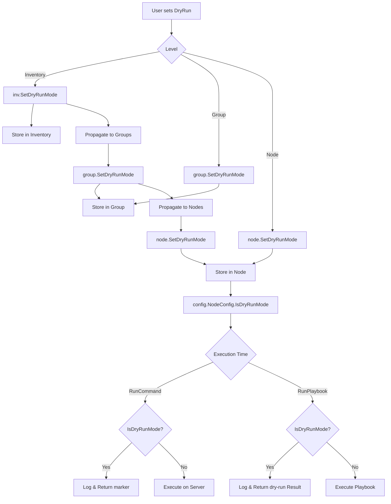

## Check Mode Flow

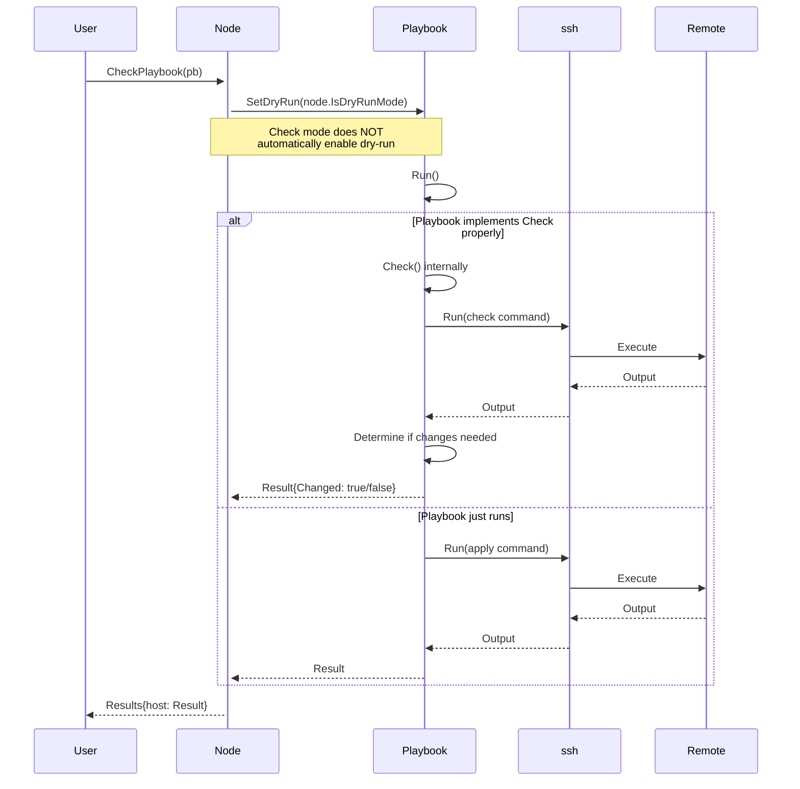

## Results Aggregation Flow

```mermaid
graph TD
    A[Operation on Multiple Nodes] --> B[Create Results Map]
    B --> C[Execute on Node 1]
    B --> D[Execute on Node 2]
    B --> E[Execute on Node 3]
    
    C --> F[Result 1]
    D --> G[Result 2]
    E --> H[Result 3]
    
    F --> I[results.Results["node1"] = Result 1]
    G --> J[results.Results["node2"] = Result 2]
    H --> K[results.Results["node3"] = Result 3]
    
    I --> L[Results Struct]
    J --> L
    K --> L
    
    L --> M[Summary]
    M --> N[Total Count]
    M --> O[Changed Count]
    M --> P[Unchanged Count]
    M --> Q[Failed Count]
```

## SSH Connection Flow (Detailed)

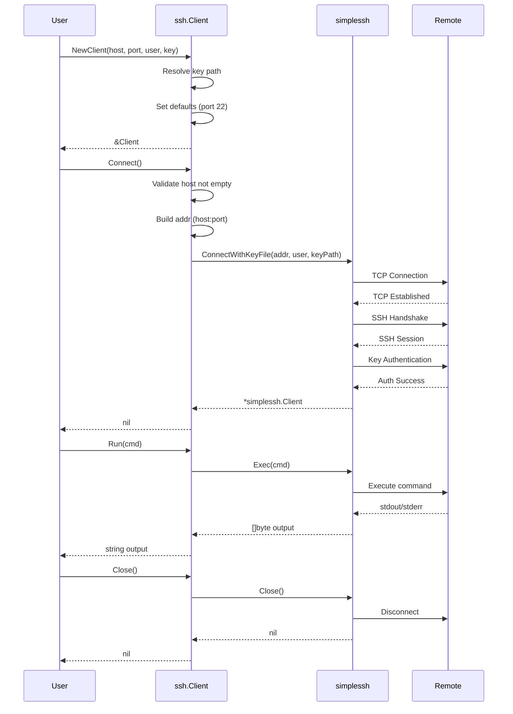

## Configuration Inheritance Flow

```mermaid
graph TD
    A[User sets Arg] --> B{Level}
    
    B -->|Inventory| C[inv.SetArg?]
    Note over C: Inventory doesn't store args<br/>directly - uses groups
    
    B -->|Group| D[group.SetArg]
    D --> E[group.args map]
    E --> F[Inherited by nodes?]
    Note over F: No - args are NOT<br/>automatically propagated
    
    B -->|Node| G[node.SetArg]
    G --> H[node.cfg.Args map]
    
    I[Playbook Execution] --> J{Arg Source}
    J -->|Node Level| K[GetArg from node.cfg.Args]
    J -->|Playbook Level| L[GetArg from playbook.cfg.Args]
    
    M[Node to Playbook] --> N[pb.SetConfig node.cfg]
    N --> O[Playbook copies Args map]
    O --> P[Playbook can override args]
```

## Error Handling Flow

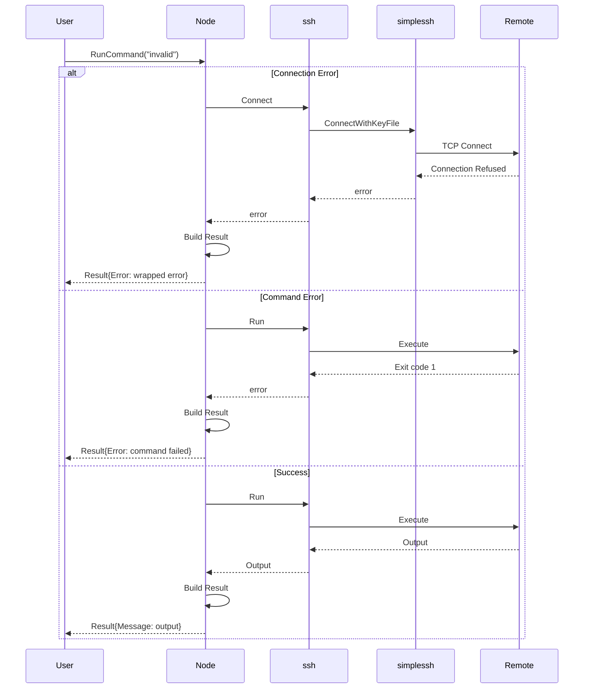

## See Also

- [Architecture](architecture.md) - High-level architecture
- [API Reference](api_reference.md) - API documentation
- [Configuration](configuration.md) - Configuration options
