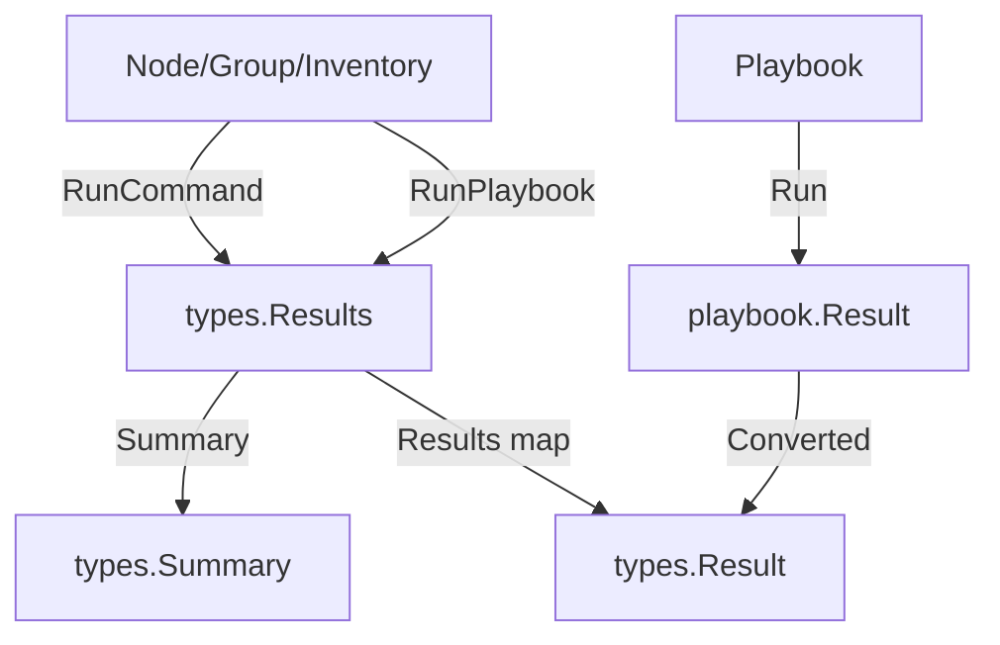

# types Package

## Changelog
- **v1.2.0** (2026-04-14): Added PromptConfig and PromptResult types for interactive user input
- **v1.1.0** (2026-04-14): Updated PlaybookInterface and Registry documentation
- **v1.0.0** (2025-04-14): Initial creation

Shared types for playbooks, registries, commands, and operation results across all Ork packages.

## Purpose

The `types` package provides:
- `PlaybookInterface`: The interface all playbooks must implement
- `Registry`: For registering and looking up playbooks by ID
- `Command`: Struct for shell commands with descriptions
- `PlaybookOptions`: Configuration options for playbook execution
- `PromptConfig`, `PromptResult`: Types for interactive user input
- `Result`, `Results`, `Summary`: Operation outcome types

## Key Files

| File | Purpose |
|------|---------|
| `registry.go` | PlaybookInterface, PlaybookOptions, Registry |
| `command.go` | Command struct with description |
| `prompt.go` | PromptConfig, PromptResult types |
| `results.go` | Result, Results, and Summary types |

## PlaybookInterface

All automation playbooks must implement this interface.

```go
type PlaybookInterface interface {
    // Identification
    GetID() string
    SetID(id string) PlaybookInterface
    GetDescription() string
    SetDescription(description string) PlaybookInterface
    
    // Configuration
    GetNodeConfig() config.NodeConfig
    SetNodeConfig(cfg config.NodeConfig) PlaybookInterface
    
    // Arguments
    GetArg(key string) string
    SetArg(key, value string) PlaybookInterface
    GetArgs() map[string]string
    SetArgs(args map[string]string) PlaybookInterface
    
    // Execution options
    IsDryRun() bool
    SetDryRun(dryRun bool) PlaybookInterface
    GetTimeout() time.Duration
    SetTimeout(timeout time.Duration) PlaybookInterface
    
    // Core operations
    Check() (bool, error)
    Run() Result
}
```

### Check

Determines if the playbook needs to make changes.

```go
func (p PlaybookInterface) Check() (bool, error)
```

- Returns `true` if changes are needed
- Returns `false` if system is already in desired state
- Returns error if the check itself fails

### Run

Executes the playbook and returns the result.

```go
func (p PlaybookInterface) Run() Result
```

The `Result.Changed` field indicates whether any modifications were made.

## PlaybookOptions

Configuration options for playbook execution.

```go
type PlaybookOptions struct {
    Args    map[string]string  // Override node-level args
    DryRun  bool               // Override dry-run mode
    Timeout time.Duration      // Execution timeout
}
```

Used with `RunPlaybookByID()` for per-execution overrides.

## PromptConfig

Configuration for a single user prompt.

```go
type PromptConfig struct {
    Name     string             // Variable name
    Prompt   string             // Prompt message to display
    Private  bool               // Hide input (true) or show it (false)
    Default  string             // Default value if user provides no input
    Confirm  bool               // Require confirmation (for passwords)
    Validate func(string) error // Validation function
    Required bool               // Whether the field is required
}
```

### Fields

- **Name**: The variable name for storing the result
- **Prompt**: The message displayed to the user
- **Private**: If true, input is hidden (like a password)
- **Default**: Default value used if user provides no input
- **Confirm**: If true, requires confirmation (for passwords)
- **Validate**: Optional validation function that returns an error if invalid
- **Required**: If true, empty input is rejected

### Example

```go
cfg := types.PromptConfig{
    Name:     "email",
    Prompt:   "Email address",
    Private:  false,
    Default:  "user@example.com",
    Confirm:  false,
    Required: true,
    Validate: func(value string) error {
        if !strings.Contains(value, "@") {
            return fmt.Errorf("invalid email format")
        }
        return nil
    },
}
```

## PromptResult

Contains the results of a prompt session.

```go
type PromptResult map[string]string
```

A map of variable names to user-provided values.

### Example

```go
results := types.PromptResult{
    "username": "admin",
    "password": "secret123",
    "port":     "8080",
}

// Access values
username := results["username"]
password := results["password"]
```

### With PromptMultiple

```go
prompts := []types.PromptConfig{
    {Name: "username", Prompt: "Username", Required: true},
    {Name: "password", Prompt: "Password", Private: true, Confirm: true, Required: true},
}

results, err := ork.PromptMultiple(prompts)
if err != nil {
    log.Fatal(err)
}

username := results["username"]
password := results["password"]
```

## Registry

Playbook registry for ID-based lookup.

```go
type Registry struct {
    playbooks map[string]PlaybookInterface
    mu        sync.RWMutex
}
```

### Constructor

```go
func NewRegistry() *Registry
```

### Methods

```go
// Register a playbook
func (r *Registry) PlaybookRegister(p PlaybookInterface) error

// Find playbook by ID
func (r *Registry) PlaybookFindByID(id string) (PlaybookInterface, bool)

// List all registered playbooks
func (r *Registry) PlaybookList() []PlaybookInterface

// Get all playbook IDs
func (r *Registry) GetPlaybookIDs() []string
```

### Usage

```go
// Create registry
registry := types.NewRegistry()

// Register playbooks
registry.PlaybookRegister(playbooks.NewPing())
registry.PlaybookRegister(playbooks.NewAptUpdate())

// Lookup by ID
pb, ok := registry.PlaybookFindByID("ping")
if ok {
    result := pb.Run()
}
```

## Command

Represents a shell command with its description.

```go
type Command struct {
    Command     string
    Description string
}
```

Used to display and execute shell commands in a structured way, especially useful in dry-run mode to show what commands would be executed.

### Example

```go
cmd := types.Command{
    Command: "ls -la",
    Description: "List all files in long format",
}
```

## Result

Represents the outcome of a single operation (command or playbook execution).

```go
type Result struct {
    Changed bool              // Whether changes were made
    Message string            // Human-readable description
    Details map[string]string // Additional information
    Error   error             // Non-nil if execution failed
}
```

### Changed

Indicates whether the operation modified the system.

- `true`: Changes were made (e.g., packages updated, user created)
- `false`: System was already in the desired state (idempotent operation)

```go
if result.Changed {
    log.Println("System was modified")
} else {
    log.Println("No changes needed")
}
```

### Message

A human-readable description of what happened.

```go
// Examples:
result.Message = "Package database updated"
result.Message = "User 'alice' created"
result.Message = "2GB swap file created"
result.Message = "Already configured - no changes made"
```

### Details

Additional key-value information about the operation.

```go
result.Details = map[string]string{
    "size":        "2GB",
    "file":        "/swapfile",
    "swappiness":  "10",
    "output":      "... command output ...",
}

// Access details
for key, value := range result.Details {
    log.Printf("%s: %s", key, value)
}
```

Common detail keys by playbook:

| Playbook | Detail Keys |
|----------|-------------|
| ping | `uptime` |
| apt-update | `output` |
| swap-create | `size`, `file`, `swappiness`, `status` |
| user-create | `username`, `home`, `shell` |
| mariadb-status | Various status fields |

### Error

Non-nil if the operation failed. When `Error` is non-nil, `Changed` may still be `true` if some changes occurred before the failure.

```go
if result.Error != nil {
    log.Fatalf("Operation failed: %v", result.Error)
}
```

## Results

Contains per-node results from any operation (command or playbook) on multiple nodes.

```go
type Results struct {
    Results map[string]Result  // Key is node hostname
}
```

The `Results` map keys are hostnames (as configured when creating nodes).

### Summary

Returns aggregated statistics about all results.

```go
func (r Results) Summary() Summary
```

```go
results := inv.RunPlaybook(playbooks.NewPing())
summary := results.Summary()

fmt.Printf("Total: %d\n", summary.Total)
fmt.Printf("Changed: %d\n", summary.Changed)
fmt.Printf("Unchanged: %d\n", summary.Unchanged)
fmt.Printf("Failed: %d\n", summary.Failed)
```

### Iterating Results

```go
results := group.RunPlaybook(playbooks.NewAptUpdate())

for hostname, result := range results.Results {
    if result.Error != nil {
        log.Printf("%s: FAILED - %v", hostname, result.Error)
    } else if result.Changed {
        log.Printf("%s: CHANGED - %s", hostname, result.Message)
    } else {
        log.Printf("%s: OK (no changes)", hostname)
    }
}
```

## Summary

Aggregated statistics from a `Results` collection.

```go
type Summary struct {
    Total     int  // Total number of nodes
    Changed   int  // Nodes where changes were made
    Unchanged int  // Nodes with no changes needed
    Failed    int  // Nodes where execution failed
}
```

### Usage

```go
results := inv.RunPlaybook(playbooks.NewAptUpgrade())
summary := results.Summary()

// Quick status check
if summary.Failed > 0 {
    log.Printf("WARNING: %d nodes failed", summary.Failed)
}

if summary.Changed == summary.Total {
    log.Println("All nodes were updated")
}
```

## Type Relationships



Note: `playbook.Result` and `types.Result` have identical structures but are defined separately for package isolation.

## Conversion

The `ork` package converts `playbook.Result` to `types.Result`:

```go
// From playbook.Result
pbResult := playbook.Result{
    Changed: true,
    Message: "Success",
    Details: map[string]string{"key": "value"},
    Error:   nil,
}

// To types.Result
typesResult := types.Result{
    Changed: pbResult.Changed,
    Message: pbResult.Message,
    Details: pbResult.Details,
    Error:   pbResult.Error,
}
```

## Examples

### Handling Single Node Result

```go
node := ork.NewNodeForHost("server.example.com")
results := node.RunCommand("uptime")

// Single node - key is the hostname
result := results.Results["server.example.com"]

if result.Error != nil {
    log.Fatalf("Command failed: %v", result.Error)
}

log.Println(result.Message)
```

### Handling Multiple Node Results

```go
inv := ork.NewInventory()
// ... add groups with nodes ...

results := inv.RunPlaybook(playbooks.NewPing())

// Get summary first
summary := results.Summary()
log.Printf("Ping results: %d total, %d failed", 
    summary.Total, summary.Failed)

// Process individual results
for hostname, result := range results.Results {
    if result.Error != nil {
        log.Printf("[%s] Connection failed: %v", hostname, result.Error)
        continue
    }
    
    log.Printf("[%s] Connected: %s", hostname, result.Message)
    
    if uptime, ok := result.Details["uptime"]; ok {
        log.Printf("[%s] Uptime: %s", hostname, uptime)
    }
}
```

### Error Handling Patterns

```go
results := group.RunPlaybook(playbooks.NewAptUpgrade())

// Pattern 1: Fail on any error
for hostname, result := range results.Results {
    if result.Error != nil {
        log.Fatalf("%s failed: %v", hostname, result.Error)
    }
}

// Pattern 2: Collect errors and report
var failures []string
for hostname, result := range results.Results {
    if result.Error != nil {
        failures = append(failures, fmt.Sprintf("%s: %v", hostname, result.Error))
    }
}
if len(failures) > 0 {
    log.Printf("Completed with %d failures:\n%s", 
        len(failures), strings.Join(failures, "\n"))
}

// Pattern 3: Continue on errors, report at end
summary := results.Summary()
if summary.Failed > 0 {
    log.Printf("WARNING: %d/%d nodes failed", summary.Failed, summary.Total)
}
```

### Check Mode Results

```go
// Preview changes
results := node.CheckPlaybook(playbooks.NewAptUpgrade())
result := results.Results["server.example.com"]

if result.Changed {
    log.Printf("Would upgrade: %s", result.Message)
    // Now actually run it
    results = node.RunPlaybook(playbooks.NewAptUpgrade())
} else {
    log.Println("No upgrades needed")
}
```

## Design Notes

### Why PlaybookInterface in types Package?

Package isolation prevents circular dependencies:
- `types` package defines `PlaybookInterface` and `Registry`
- `playbook` package provides `BasePlaybook` implementation
- `ork` package uses types.PlaybookInterface for type safety
- This allows the registry to be in a lower-level package

### Why Separate types.Result and playbook.Result?

Package isolation prevents circular dependencies:
- `playbook` package defines `playbook.Result`
- `types` package defines `types.Result` 
- `ork` package converts between them
- Both have identical structure for consistency

### Map Key Choice

Results use hostname as the map key because:
1. Hostname is the primary identifier for nodes
2. IP addresses may change
3. Natural fit for `NewNodeForHost(host)` pattern
4. Human-readable in logs and output

### Empty Results

Always check if hostname exists in the map:

```go
result, ok := results.Results["server.example.com"]
if !ok {
    log.Fatal("No result for host")
}
```

## See Also

- [ork](ork.md) - Uses types.Results for all operations
- [playbook](playbook.md) - Defines playbook.Result
- [API Reference](../api_reference.md) - Complete API
