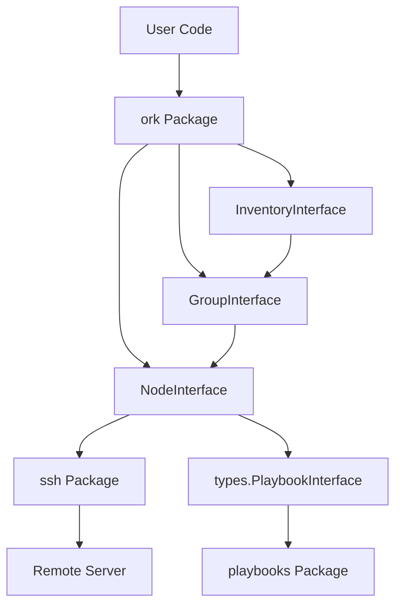

# Ork Overview

Ork is a **Go package for SSH-based server automation**. Think of it like Ansible, but written in Go. You define **Nodes** (remote servers), organize them into **Groups**, and run commands or playbooks against them individually or at scale via **Inventory**.

## What is Ork?

Ork provides a simple, type-safe API for managing remote Linux servers over SSH. It combines the power of Go's strong typing and concurrency with Ansible-style declarative automation.

### Key Features

| Feature | Description |
|---------|-------------|
| **SSH-Based** | Connects to servers via SSH with key-based authentication |
| **Type-Safe** | Full Go type safety with interfaces and compile-time checking |
| **Idempotent** | All operations are idempotent - safe to run multiple times |
| **Concurrent** | Inventory operations run concurrently across nodes |
| **Dry-Run Mode** | Preview changes without executing them on servers |
| **Playbook System** | Pre-built automation tasks for common operations |
| **Fluent API** | Chain methods for readable configuration |

## Architecture Overview



## Core Concepts

### 1. Node

A `Node` represents a single remote server:

```go
node := ork.NewNodeForHost("server.example.com").
    SetPort("2222").
    SetUser("deploy").
    SetKey("production.prv")
```

### 2. Group

A `Group` organizes multiple nodes:

```go
webGroup := ork.NewGroup("webservers")
webGroup.AddNode(node1)
webGroup.AddNode(node2)
webGroup.SetArg("env", "production")
```

### 3. Inventory

An `Inventory` manages multiple groups for large-scale operations:

```go
inv := ork.NewInventory()
inv.AddGroup(webGroup)
inv.AddGroup(dbGroup)
results := inv.RunPlaybook(playbooks.NewAptUpdate())
```

### 4. Playbooks

Playbooks are reusable automation tasks:

```go
// Run a built-in playbook
results := node.RunPlaybook(playbooks.NewAptUpdate())

// Run by ID (registry lookup)
results := node.RunPlaybookByID(playbooks.IDPing)
```

## Built-in Playbooks

| Category | Playbooks |
|----------|-----------|
| **System** | ping, reboot, apt-update, apt-upgrade, apt-status |
| **Users** | user-create, user-delete, user-status |
| **Swap** | swap-create, swap-delete, swap-status |
| **Security** | ssh-harden, kernel-harden, aide-install, auditd-install, ssh-change-port |
| **Firewall** | ufw-install, ufw-status, ufw-allow-mariadb |
| **Fail2ban** | fail2ban-install, fail2ban-status |
| **MariaDB** | mariadb-install, mariadb-secure, mariadb-create-db, mariadb-create-user, mariadb-status, mariadb-backup |

## Quick Example

```go
package main

import (
    "log"
    "github.com/dracory/ork"
    "github.com/dracory/ork/playbooks"
)

func main() {
    // Create a node
    node := ork.NewNodeForHost("server.example.com").
        SetPort("2222").
        SetUser("deploy")
    
    // Check connectivity
    results := node.RunPlaybook(playbooks.NewPing())
    if results.Results["server.example.com"].Error != nil {
        log.Fatal("Connection failed")
    }
    
    // Update packages
    results = node.RunPlaybook(playbooks.NewAptUpdate())
    
    // Create a user
    node.SetArg("username", "alice")
    results = node.RunPlaybook(playbooks.NewUserCreate())
    
    log.Println(results.Results["server.example.com"].Message)
}
```

## Design Philosophy

1. **Simplicity**: Simple API that feels natural to Go developers
2. **Safety**: Dry-run mode prevents accidental changes
3. **Idempotency**: Operations can be safely repeated
4. **Composability**: Build complex operations from simple primitives
5. **Type Safety**: Leverage Go's type system for reliability

## Use Cases

- **Server Provisioning**: Set up new servers with standard configuration
- **Configuration Management**: Keep server configurations in sync
- **Security Hardening**: Apply security policies across infrastructure
- **Database Management**: Install and configure MariaDB servers
- **User Management**: Create and manage system users
- **Package Management**: Update and install software packages

## License

Ork is licensed under the GNU Affero General Public License v3.0 (AGPL-3.0). Commercial licenses are available upon request.

## See Also

- [Getting Started](getting_started.md) - Installation and quick start guide
- [Architecture](architecture.md) - System architecture and design patterns
- [API Reference](api_reference.md) - Complete API documentation
- [Modules](modules/ork.md) - Module documentation
